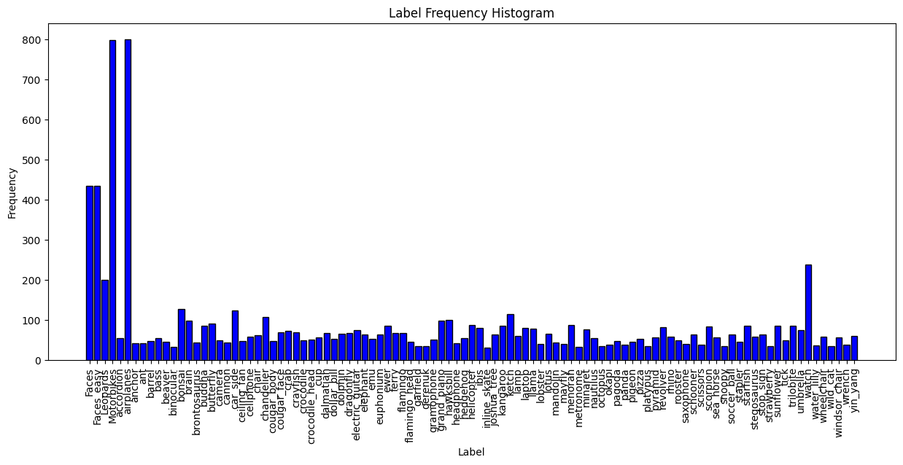
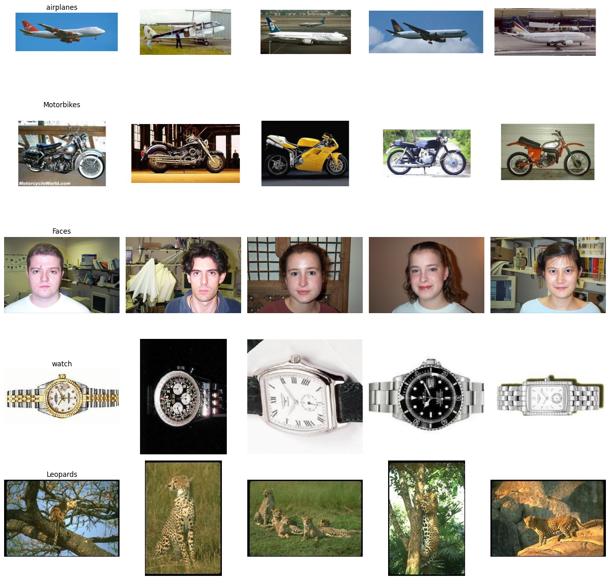
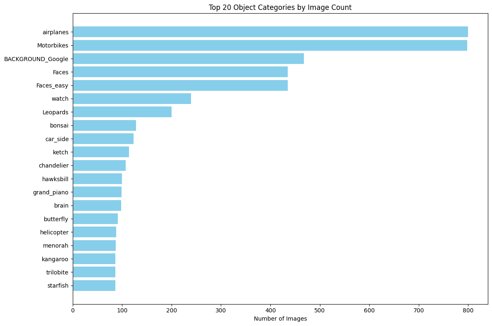
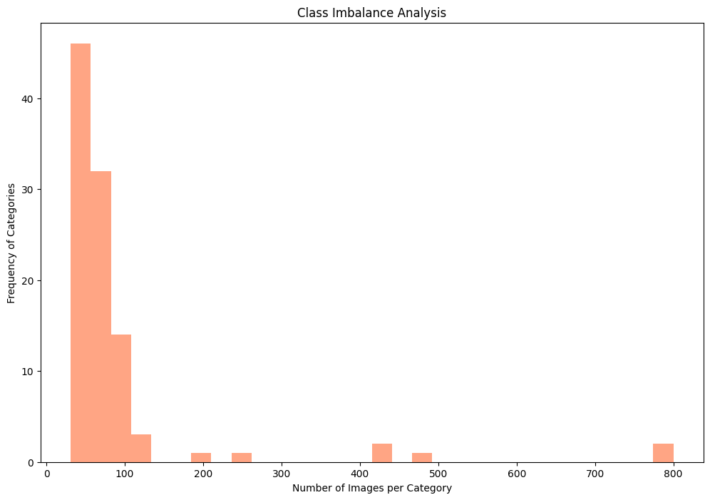
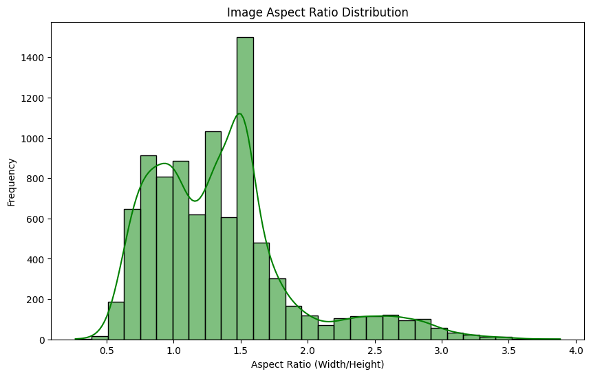
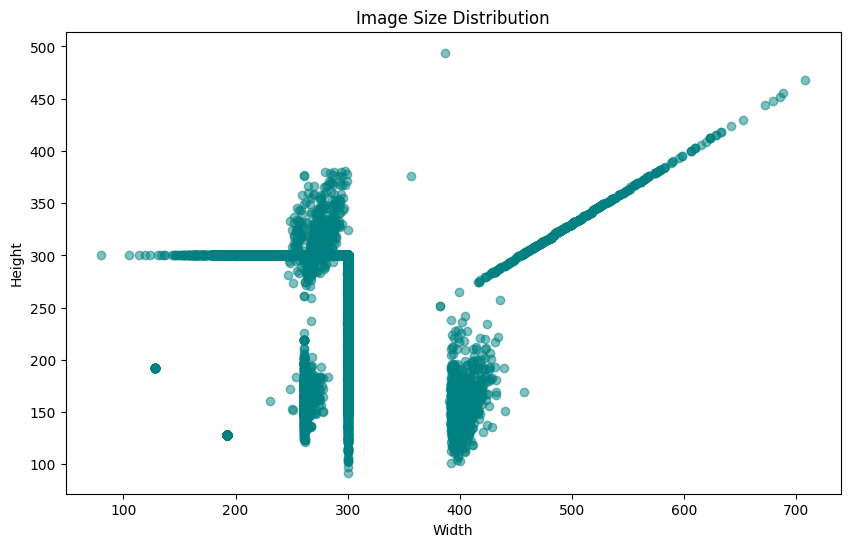
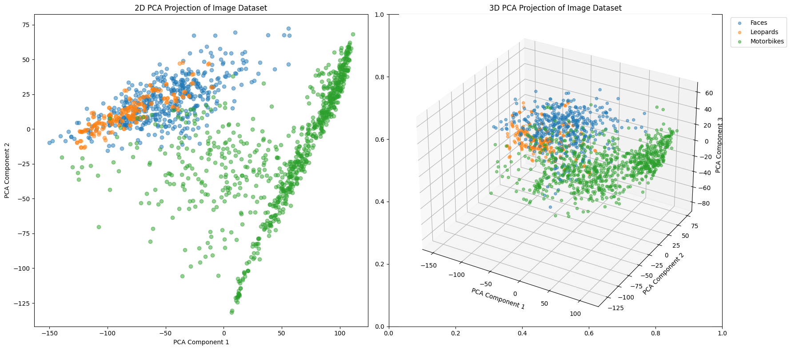
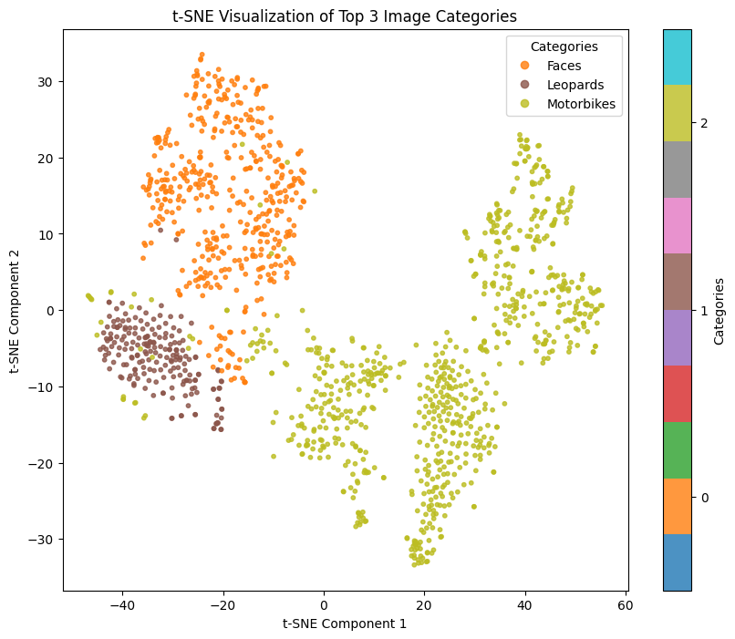
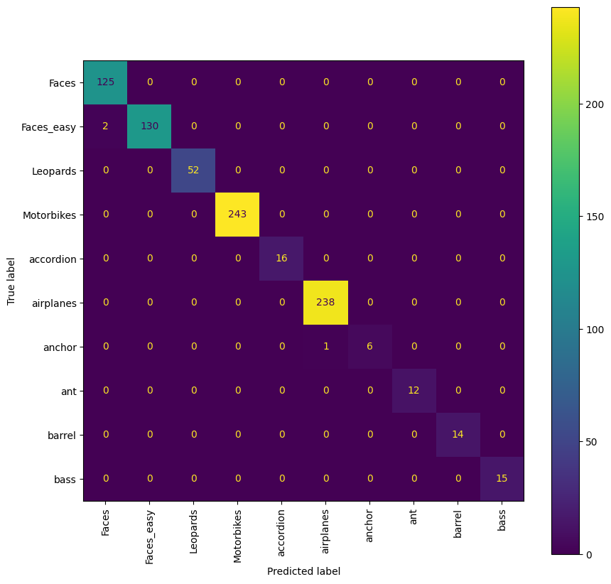

# ECEN 758 Data Mining Project

Group 16.
Team Members:
1. Tripp Cator
2. Junzhe Zhang
3. Rohith Yogi Nomula
4. Satya Bhavsar
5. Yash Patil

## Introduction

### Overview of dataset

We used the Caltech101 dataset for the project. The Caltech 101 dataset, introduced by Fei-Fei et al. in 2004, is a widely used dataset for object recognition tasks. It contains 9,144 images spanning 101 distinct object categories, such as animals, vehicles, instruments, and everyday objects, and an additional background category. Each category contains between 40 to 800 images, with most categories having about 50 images. The images are of varying sizes and resolutions, presenting real-world challenges for object classification tasks. The dataset provides a balanced variety of classes, making it suitable for multi-class classification problems in computer vision tasks.

### Experiments
In this project, we aim to develop a classification model for the Caltech 101 dataset. The following key steps are followed:
- Data Preparation: We perform data cleansing and transformations of the images. We also split the dataset into training, validation, and test sets
- Exploratory Data Analysis (EDA): Descriptive statistics and visualizations are used to better understand the dataset, including class distributions, image sizes, and example visualizations of different classes. Dimensionality reduction techniques like PCA and t-SNE are applied to visualize patterns in the dataset.
- Architecture Selection: We utilize a ResNet-18 backbone, leveraging its proven performance in image classification tasks. We fine-tune the model for our dataset to optimize performance.
- Model Evaluation: We use performance metrics such as accuracy, precision, recall, and F1-score to evaluate the model’s effectiveness

## Method

### Data Preprocessing

We applied various pre-processing steps to the data. Since some of the images were grayscale, we converted all the images to RGB. To keep a consistent size, we resized all the images to a standard size of 250x250. We then randomly crop images to a size of 224 to make the model generalize better. We also applied RandomHorizontalFlip transform to make the model more robust and accurate. Finally, we normalize the images over the pixel values with the mean and standard deviation of ImageNet database since we will be using transfer learning. We lastly split the data into a training set consisting of 70% of the data sampled randomly and a test set comprised of the remaining 30%. For validation purposes, we employ k-fold cross-validation on the training data.

### Exploratory Data Analysis (EDA)

We analyzed the Caltech-101 dataset to understand it better. The airplanes and motorbikes categories have the maximum number of samples, with more than 700 samples in each category from as seen in the following figure. 

We also analyzed images for the top 5 categories by count as seen in the following figure to see the generic differences in images. This shows that it contains images with different backgrounds and orientations.

The next figure shows the top 20 categories sorted by image count to depict the nature of the dataset. We have also used LabelEncoder a built in module of scikit-learn and used it for converting categorical labels like we see above into numeric values.

With the class imbalance plot as shown below, we infer that most of the categories have 25-150 samples, implying a roughly balanced dataset.

The image aspect ratio distribution in the figure below shows that most of the images have an aspect ration between 0.5 and 2. 

The size of the images as seen in the figure below pretty inconsistent across the dataset as we see lot of data points with varying height and width these factors can have been accounted for when we resize the image before training on them.

The mean for images in Caltech dataset is found to be [0.50215038 0.52877569 0.54587129] and the standard deviation is [0.32555729 0.31311518 0.31876227]. The mean signifies the average intensity across each channel and the standard deviation signifies variability in pixel intensity for each color channel.The dataset appears to be well-balanced in terms of brightness and contrast, with no significant bias toward any single channel.

We also performed principle component analysis (PCA) for a few classes to see the dimensional nature of the data. We observed that plot for PCA for all the classes at once cannot depict the full nature of data due to presence of too many points and colors. Therefore, we did a 2D PCA and a 3D PCA projection for top 3 frequency classes. Faces, Motorcycles and Leopards has a clear separation in the data, and it can be categorized just by further preserving local structure and clusters using t-SNE for these three classes. 

PCA helped us visualize the dataset with respect to global structure and variance. The 2D/3D PCA plots show how the different categories of images are spread across the principal components. The t-SNE plot focuses on the local relationships between images to group similar images closer together, this offers a clearer view of how well-separated the categories are based on their features.

### Model Selection

#### Algorithm selection

For this project, we chose a Convolutional Neural Network (CNN), specifically ResNet-18, as the classification model. CNNs are widely regarded as the most effective algorithms for image classification tasks due to their ability to automatically learn hierarchical features from images. This hierarchical feature extraction eliminates the need for manual feature engineering by identifying low-level features such as edges and textures, as well as high-level patterns like shapes and objects. Furthermore, CNNs exhibit spatial invariance through convolutional and pooling layers, allowing them to detect features regardless of their position within the image.

CNNs also excel in scalability and robustness, making them suitable for datasets of various sizes and complexities. ResNet-18, a pre-trained CNN architecture, leverages transfer learning to accelerate model development and enhance performance by utilizing knowledge from larger datasets such as ImageNet. Its proven success in similar image classification tasks makes it a compelling choice for the Caltech 101 dataset.

ResNet-18 was selected for its efficiency, robustness, and compatibility with the Caltech 101 dataset. A key feature of ResNet-18 is its use of residual connections, which mitigate the vanishing gradient problem by enabling gradients to flow directly through shortcut connections. This allows for effective training of deeper networks without performance degradation, a common issue in earlier CNN architectures.

The architecture’s lightweight design, consisting of 18 layers, strikes a balance between computational feasibility and model complexity. It is efficient enough to train on standard hardware while maintaining sufficient depth to learn diverse patterns present in the Caltech 101 dataset. Additionally, ResNet-18’s pre-trained weights from ImageNet facilitate transfer learning, reducing training time and improving generalization on the medium-sized dataset.

#### Model Building

We used the pre-trained ResNet-18 model and customized its fully connected (FC) layer to match the number of classes in the Caltech-101 dataset. The modified FC layer includes a dropout layer with a 50% dropout rate to reduce overfitting and a linear layer that outputs predictions for the dataset’s 101 classes. This configuration helps ensure that the model can generalize effectively while retaining the knowledge learned from the pre-trained weights.

With this modified architecture established, we then fine-tuned the network weights over 5 epochs of the training dataset. We used the Stochastic Gradient Decent optimizer with a learning rate of 0.001, momentum of 0.9, and a batch size of 32. We employed a 5-fold cross validation strategy to select the network weights with the largest validation accuracy.

## Experimental Results and Discussion

We evaluate the effectiveness of ResNet by applying it to the Caltech-101 dataset. We also tune our model parameters to optimize our model.

### Training

We divide the dataset into a training set and a validation set. We utilize K-fold cross-validation to partition the data into `k = 5` subsets, one chosen as the validation set each time and the rest as the training set. The data is loaded by batch.

We use ResNet-18 as the baseline model with the SGD optimizer and load the weights of the pre-trained model using transfer learning. By modifying the fully connected layer, we make it adapt to the number of data categories. We added a Dropout layer to the ResNet-18 model with a probability of 0.5 to prevent model overfitting. We opted for the SGD optimizer because Adam's fast convergence makes it easy to get stuck a the local optimum. Adam's regularization is weak, which reduces the stochasticity of the model update and therefore leads to insufficient generalization ability.

By continuously adjusting the hyperparameters of the model with cross validation, ResNet-18 eventually achieves optimal performance with settings as shown in the following table.

| Hyperparameter  | Value |
| ------------- | ------------- |
| Learning Rate  | 0.001  |
| Momentum  | 0.9  |
| Dropout | 0.5 |
| Number of Epochs | 5 |
| Loss Function       | Cross-Entropy Loss  |
| Optimizer         | Stochastic Gradient Descent |

### Validation

With the Adam optimizer, we saw an average of 85% accuracy on the validation set. With SGD, the 5-fold cross-validation procedure trained for 5 epochs produced five models with training accuracies ranging from 89.07% - 89.98% and validation accuracies ranging from 91.27% - 93.00%. The weights generated by the second fold with a validation accuracy of 93% were saved for testing.

### Test Results

To evaluate the performance of the models on the test set, we used common classification performance metrics as shown in the following table:

| **Measure**   | Accuracy | Precision | Recall | F1-Score |
|----------------|--------------|---------------|------------|--------------|
| **Value**      | 95.51%       | 95.76%        | 95.51%     | 95.34%       |

*Precision, Recall, and F1-Score were computed for each feature and averaged to give the results reported above.*

The accuracy of 95.51% indicates that for the test samples, the model successfully classified 95.51% of the samples. Since Caltech-101 is a multi-classification task, the precision rate, recall rate, and F1 score were averaged across all classes to measure the overall performance of the model. A precision rate of 95.76% indicates that a high percentage of all samples predicted to be in a particular category were correctly predicted. A recall rate of 95.51% indicates that the model was able to identify most of the samples that actually belonged to a particular category. The F1 score of 95.34% also indicates that the overall performance of the model is good for this multi-classification task.

Due to the size of the Caltech-101 dataset, we also visualize the partial confusion matrix as shown in the following figure. 

From the figure, we can observe that most of the categories of samples are correctly categorized because the vast majority of the highlighted values in the heat map are located on the diagonal line. For example, the Faces and Motorbikes categories were predicted completely correctly. However, for the category Anchor, there is 1 sample that is misclassified. Misclassification between categories can be due to images that are too similar, such as having similar textures or similar shapes. For example, Faces and Faces\_easy are both images that contain faces. Therefore, although the backgrounds are different, these two categories can still be misclassified due to the similar textures and expressions of the faces. Similar results are seen in the full confusion matrix that can be found in the codebase.

## Conclusion

In this project, we explored a multi-class classification task using ResNet-18 for the Caltech-101 dataset. By optimizing the hyperparameters, the model achieves accurate classification for the data categories. On the test set, our tuned model can achieve 95.51% classification accuracy and 95.34% F1 score, which shows that our model has good classification performance.

Model Interpretablity : ResNet-18 employs a hierarchical structure, with earlier layers extracting low-level features such as edges and textures, while deeper layers focus on more abstract patterns like shapes and class-specific characteristics. We relied on a qualitative review of the model’s performance through metrics like the confusion matrix. The confusion matrix helped us identify patterns in the model’s errors, particularly for visually similar classes. The insights helped us evaluate whether the model was learning meaningful distinctions between classes.

The model developed can be used across industries to improve classification tasks. Businesses in sectors such as healthcare, retail, and security can benefit from the ability to automatically categorize large amounts of image data with high accuracy and transparency.

Future work could involve experimenting with other architectures, exploring more advanced data augmentation methods, and investigating ensemble approaches to further improve classification accuracy. Additionally, expanding the dataset or addressing class imbalance could also enhance model performance for specific underrepresented classes.
